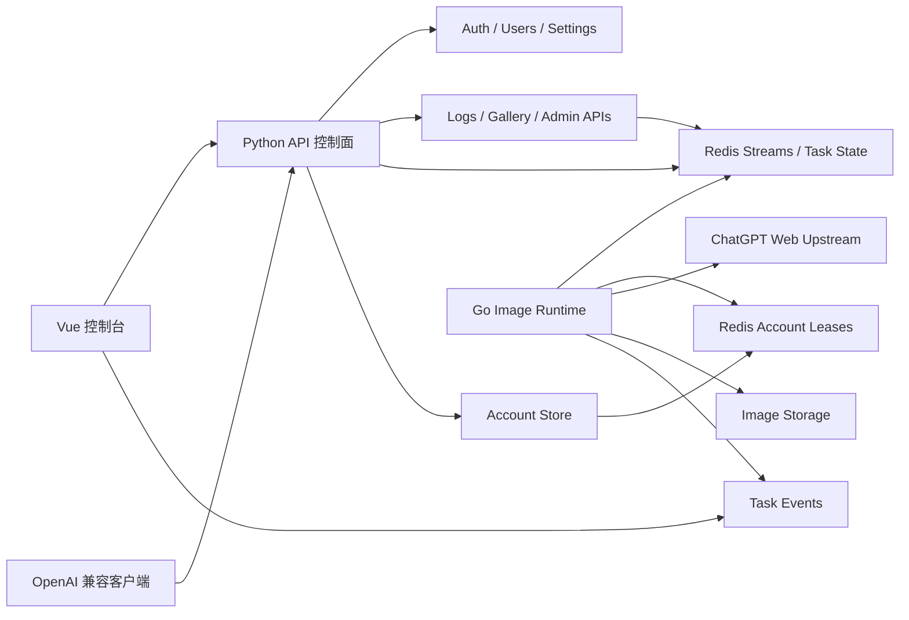

# 1000 TPM 架构计划

这里的 TPM 暂按“图片任务每分钟”理解。如果只是文本 token per minute，现有架构压力完全不是一个量级；本计划面向高频文生图/图生图。

## 结论

不建议立刻全量 Go 重写。推荐路线是：

```text
Vue 控制台
  ↓
Python FastAPI 控制面
  - 认证 / 用户密钥
  - 设置 / 账号导入 / OAuth / CPA / Sub2API / 注册机后续
  - 日志查询 / 画廊 / 兼容接口入口
  ↓
Redis / Postgres
  - 任务队列
  - 账号租约
  - 任务状态
  - 指标和事件
  ↓
Go 图片数据面
  - 准入控制
  - 图片任务调度
  - 账号租约获取和释放
  - 上传 / SSE / poll / 下载
  - 重试 / 取消 / 超时
```

原因：

- Python 现在已经有成熟的认证、账号导入、设置、日志、存储、OpenAI 兼容接口。
- 真正高并发卡点在图片任务数据面，不在登录和设置页。
- Go 的 goroutine、channel、context 更适合长时间 I/O 任务、准入门控、取消和大规模任务调度。
- 全 Go 重写会把稳定后端也推倒，风险太大。

## 1000 TPM 的数学

吞吐和并发不是一回事。

```text
active_concurrency = tasks_per_second * average_task_seconds
```

如果目标是 1000 图片任务/分钟：

- 1000 / 60 = 16.7 tasks/sec
- 平均 60 秒完成：约 1000 个上游活跃任务
- 平均 120 秒完成：约 2000 个上游活跃任务
- 平均 160 秒完成：约 2667 个上游活跃任务

账号需求：

```text
required_accounts = active_concurrency / per_account_concurrency * safety_factor
```

假设每账号只允许 1 个图片任务并发，安全系数 1.3：

- 60 秒平均耗时：约 1300 个可用账号
- 120 秒平均耗时：约 2600 个可用账号
- 160 秒平均耗时：约 3500 个可用账号

带宽粗算：

- 每张结果图按 2 MB 算。
- 1000 张/分钟 = 2000 MB/分钟 = 约 33 MB/s = 约 266 Mbps。
- 还要加参考图上传、缩略图、重试、上游下载抖动，生产环境至少按 500 Mbps 以上规划更稳。

所以 1000 TPM 的第一瓶颈不是语言，而是：

- 上游 ChatGPT Web 真实出图耗时。
- 可用账号数量、额度、限流。
- 每账号并发策略。
- 图片上传/下载带宽。
- 任务队列、租约和恢复能力。

## 当前 Python 项目的瓶颈

从代码看，当前 Python 后端不是不能并发，而是不适合直接冲 1000 TPM。

证据：

- `services/image_task_service.py`
  - 每个图片任务启动一个 `threading.Thread`。
  - 任务状态写 `data/image_tasks.json`。
  - 每次状态更新都会 `_save_locked()` 写整个任务文件。
- `services/account_service.py`
  - 图片并发槽在单进程内用 `_image_slot_condition` 和 `_image_inflight` 管。
  - 多实例部署时这个锁不能天然共享。
- `services/protocol/conversation.py`
  - 多图时使用 `ThreadPoolExecutor(max_workers=request.n)`。
  - 图片上传、上游 SSE、poll、下载都在同一进程链路里。

这些设计对几十到几百个任务还能修补；到 1000 TPM 会出现：

- 线程数量和内存压力上升。
- 本地 JSON 状态写入成为锁和磁盘瓶颈。
- 多容器账号槽互相不知道，容易同一账号被多个实例抢。
- 某些长请求卡住会拖住 API 进程和前端体验。

## ChatGpt-Image-Studio 可参考点

`D:\ChatGpt-Image-Studio` 的 Go 后端已经有一些更接近高并发图片数据面的设计：

- `backend/api/image_admission.go`
  - channel-based 全局准入控制。
  - 支持 max concurrency、queue limit、queue timeout。
- `backend/api/image_task_manager.go`
  - 任务状态包括 queued/running/succeeded/failed/cancelled/expired。
  - 支持取消、queue TTL、完成后短期清理。
  - 支持临时失败指数退避。
  - 通过 SSE 广播 `task.upsert`。
- `backend/internal/accounts/image_routing.go`
  - 支持账号租约。
  - 支持分组、优先级、保留额度、策略过滤。
- `backend/api/request_log.go`
  - 记录 queue wait、inflight、lease、route、account、error code 等诊断字段。

这些点值得搬，但不要原样全搬。它也有自己的业务假设，比如 studio/legacy/responses 路径、Paid/Free 路由、前端形态，不一定直接适配 chatgpt2api。

## 三个方案

### 方案 A：继续纯 Python

做法：

- 把 `threading.Thread` 改成固定 worker pool。
- 用 Redis 替代 `image_tasks.json`。
- 加 Redis 分布式账号锁。
- 多 Uvicorn worker 或多容器。
- 图片任务全部异步化。

优点：

- 改动最少。
- 保留现有业务逻辑。
- 适合先稳定到 100-300 TPM。

缺点：

- Python 线程和同步 I/O 仍然会在高任务量下吃资源。
- 多进程后账号池、任务状态、日志都要外置，复杂度一样要上来。
- 1000 TPM 不是理想目标。

### 方案 B：Python 控制面 + Go 图片数据面，推荐

做法：

- Python 保留认证、设置、账号导入、用户密钥、日志查询、画廊、备份。
- Go 负责图片任务调度、准入、租约、上传、SSE、poll、下载。
- Redis 做任务队列、事件流、账号租约和状态缓存。
- Postgres 或 SQLite/Redis 做可查询历史，生产建议 Postgres。

优点：

- 把最重的长 I/O 并发放到 Go。
- 不推倒现有 Python 后端。
- 可以灰度：先让 `/api/image-tasks/*` 走 Go，`/v1/images/*` 保留 Python 或转任务。
- 1000 TPM 有现实扩展路径。

缺点：

- 多一个服务，部署复杂度增加。
- 需要定义 Python-Go 内部 API 和共享数据模型。
- 账号状态一致性要认真做。

### 方案 C：全 Go 重写

做法：

- 后端全部重写成 Go。
- Python 项目只保留参考逻辑。
- 认证、设置、账号、日志、图片、注册机全部重新实现。

优点：

- 单语言后端。
- 长期性能和部署形态更干净。

缺点：

- 风险最大。
- 现有稳定逻辑要重新踩坑。
- 图生图失败诊断、OpenAI 兼容细节、账号导入都要重做。

结论：不适合现在直接做。可以等混合架构跑稳后，再决定是否继续迁移控制面。

## 推荐架构



## Go 图片数据面设计

### 1. 准入控制

每个 Go 实例有本地门控：

- `max_running_units`
- `queue_limit`
- `queue_timeout`

超过 queue limit：

- 管理台任务：返回 queued/full 语义。
- OpenAI 兼容接口：返回 429 或 503。

### 2. 任务队列

建议使用 Redis Streams：

- `image:tasks`
- `image:events`
- consumer group: `image-workers`

任务状态单独存：

- `image:task:{id}` hash
- 状态：queued/running/succeeded/failed/cancelled/expired
- 字段：prompt hash、mode、model、size、quality、conversation_id、account_email、error_code、stage、created_at、updated_at

### 3. 账号租约

多实例必须分布式租约：

- `image:lease:{account_id}`
- TTL 大于单次任务最长时间，比如 180 秒或动态续约。
- release 必须校验 owner，避免释放别人的租约。
- 任务运行中定期续约。

### 4. Worker

Go worker 单元：

- 从 Redis Streams 读任务。
- acquire account lease。
- context timeout/cancel。
- 上传参考图。
- 发起上游会话/SSE。
- poll 结果。
- 下载图片。
- 写结果和日志。
- ack 任务。

失败分类：

- `no_available_account`
- `account_limited`
- `image_upload_failed`
- `upstream_text_reply`
- `poll_timeout`
- `content_policy`
- `network_timeout`
- `download_failed`

### 5. 限速

至少三层：

- 全局提交速率：例如 1000/min。
- 每账号并发：通常 1，后续可按账号类型调。
- 每代理/出口 IP 速率：防止一条代理被打爆。

Go 可用 token bucket 做限速。

### 6. 事件推送

前端不建议高频轮询。推荐：

- SSE：`GET /api/image-tasks/events`
- 事件：`task.upsert`、`task.remove`、`snapshot`

第一版也可以轮询，但 1000 TPM 下 SSE 更舒服。

## Python 控制面保留内容

保留 Python 的原因不是性能，而是业务复杂度已经沉淀在这里。

继续放 Python：

- `auth_service`
- `api/accounts.py`
- OAuth 登录
- CPA/Sub2API 导入
- settings
- backup
- gallery
- log query
- register 后续集成
- OpenAI 兼容入口壳

逐步外移到 Go：

- 图片准入控制
- 图片任务状态机
- 图片账号租约
- 图片上游 adapter
- 图片失败分类和重试

## 1000 TPM 初始参数

假设平均出图 90 秒：

```text
target_tpm = 1000
tasks_per_second = 16.7
active_concurrency = 16.7 * 90 = 1503
```

建议初始配置：

- Go worker 实例：3-5 个。
- 每实例 `max_running_units`: 300-500。
- 全局 Redis 队列上限：10000。
- queue TTL：10 分钟。
- 任务最长执行超时：180-240 秒。
- 每账号并发：先按 1。
- 账号需求：至少 2000 个真实可用图片账号起步。
- Redis：独立实例，开启持久化。
- 图片存储：本地只做缓存，长期存储走对象存储/WebDAV/R2。

## 验证计划

### 阶段 0：基准

- 用 mock upstream 模拟 30/60/120 秒图片任务。
- 测当前 Python：
  - 100 并发
  - 500 并发
  - 1000 并发
- 记录内存、线程数、任务成功率、日志写入耗时。

### 阶段 1：Go POC

- 只做内部 Go image runtime。
- 输入任务，mock upstream，输出 task events。
- 验证 2000 active tasks 不爆内存、不丢任务。

### 阶段 2：Redis 租约和队列

- 加 Redis Streams。
- 加账号 lease。
- 多 Go 实例并行。
- 验证同一账号不会被多实例抢。

### 阶段 3：真实上游小流量

- 10 TPM。
- 50 TPM。
- 100 TPM。
- 分析失败类型和账号消耗。

### 阶段 4：接新前端

- Vue 图片任务页接 SSE。
- 日志中心展示 error_code、stage、account_email、conversation_id。

### 阶段 5：冲 1000 TPM

- 先 mock upstream 冲到 1000 TPM。
- 再真实上游按账号容量逐步放量。

## 下一步开发顺序

1. 补 `GET /auth/status` 和 `GET /api/dashboard`，让新前端骨架稳定。
2. 写 `docs/go-image-runtime-contract.md`，定义 Python-Go 内部接口。
3. 从 `ChatGpt-Image-Studio` 抽 Go POC：
   - admission
   - image task manager
   - request log fields
   - account lease shape
4. 用 mock upstream 做压测。
5. 再决定是否把真实 ChatGPT Web adapter 搬到 Go。

## 参考资料

- Go 官方 Effective Go：goroutine 是轻量并发执行单元，channel 用于通信和同步；文档也展示了用 channel gate 限制并发资源。
  - https://go.dev/doc/effective_go#goroutines
  - https://go.dev/doc/effective_go#channels
- Python 官方术语表：普通 CPython GIL 下同一解释器同一时间只有一个线程执行 Python bytecode，CPU 并行通常要多进程或释放 GIL 的扩展。
  - https://docs.python.org/3/glossary.html#term-global-interpreter-lock
- FastAPI 官方文档：async 适合并发 I/O；生产部署可以用多 worker 进程，但 worker 只是复制进程，分布式任务状态和账号锁仍要外置。
  - https://fastapi.tiangolo.com/async/
  - https://fastapi.tiangolo.com/deployment/server-workers/
- Redis 官方文档：Streams 适合实时事件和 consumer group 消费；分布式锁需要唯一 value、TTL、校验释放，长任务要考虑续约和 fencing。
  - https://redis.io/docs/latest/develop/data-types/streams/
  - https://redis.io/docs/latest/develop/clients/patterns/distributed-locks/
