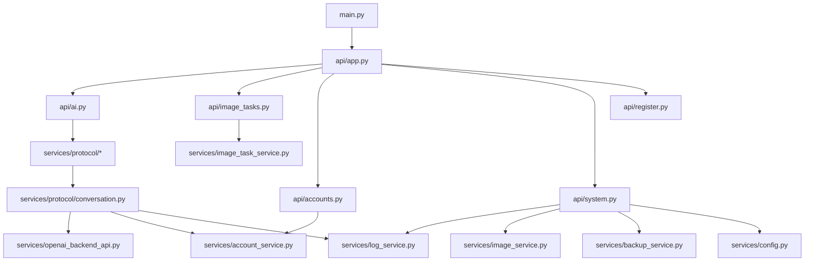

# 后端地图

## 总览

## 应用入口

- `main.py`
  - 运行入口。
- `api/app.py`
  - 创建 FastAPI app。
  - 注册 CORS、中间件、异常处理。
  - include routers。
  - 启动生命周期里启动账号 watcher、图片清理、备份服务。
  - 兜底服务前端静态资源。

## 路由层

### `api/ai.py`

OpenAI 兼容接口和文本/图片入口：

- `GET /v1/models`
- `POST /v1/images/generations`
- `POST /v1/images/edits`
- `POST /v1/chat/completions`
- `POST /v1/responses`
- `POST /v1/messages`
- `POST /v1/search`
- `GET /v1/editable-file-tasks`
- `POST /v1/ppt/generations`
- `POST /v1/psd/generations`

职责：

- 认证。
- 参数解析。
- 敏感词过滤。
- 创建 `LoggedCall`。
- 调用 `services/protocol/*` handler。

### `api/image_tasks.py`

新前端更适合使用的异步图片任务接口：

- `GET /api/image-tasks`
- `POST /api/image-tasks/generations`
- `POST /api/image-tasks/edits`
- `POST /api/image-tasks/{task_id}/resume-poll`

职责：

- 创建任务。
- 保存任务状态。
- 后台线程执行图片生成。
- 提供失败后的恢复轮询。

### `api/accounts.py`

账号池管理：

- 用户 key 管理：`/api/auth/users`
- 账号增删改查：`/api/accounts`
- 刷新和重登：`/api/accounts/refresh`、`/api/accounts/re-login`
- OAuth 登录：`/api/accounts/oauth/start`、`/api/accounts/oauth/finish`
- CPA 导入：`/api/cpa/*`
- Sub2API 导入：`/api/sub2api/*`

### `api/system.py`

管理台系统接口：

- 登录：`/auth/login`
- 版本：`/version`
- 设置：`/api/settings`
- 图片：`/api/images`
- 日志：`/api/logs`
- 代理测试：`/api/proxy/test`
- 存储和备份：`/api/storage/info`、`/api/backups`
- 图片标签和存储：`/api/images/tags`、`/api/images/storage`
- 健康检查：`/health`

## 服务层

### 图片协议核心

- `services/protocol/conversation.py`
  - 图片/文本协议主逻辑。
  - 账号选择、并发槽、重试、SSE 解析、图片轮询、文本回复识别。
  - 这是图片链路最关键文件。

- `services/openai_backend_api.py`
  - 负责连 ChatGPT 上游。
  - 上传、会话、SSE、任务查询、文件下载都在这里。

- `services/protocol/openai_v1_image_generations.py`
  - `/v1/images/generations` handler。

- `services/protocol/openai_v1_image_edit.py`
  - `/v1/images/edits` handler。

### 账号池

- `services/account_service.py`
  - 保存账号。
  - 选择图片账号。
  - 控制单账号并发。
  - 刷新 token。
  - 标记成功、失败、限流、异常。

关键点：

- `get_available_access_token`：选号。
- `release_image_slot`：释放并发槽。
- `mark_image_result`：图片结果回写账号状态。

存储现状：

- 默认账号存储已切换为本地 SQLite：`data/accounts.db`。
- `services/storage/factory.py` 仍支持通过 `STORAGE_BACKEND=json|sqlite|postgres|git` 切换后端。
- `services/account_service.py` 启动时仍会把账号池加载到内存，运行中常见账号更新走 SQLite 增量写入，避免大量账号时频繁整包重写 JSON。
- SQLite 适合本地和单容器；多容器共享同一个 SQLite 文件会遇到文件锁竞争，生产多实例建议切 PostgreSQL。

### 图片任务

- `services/image_task_service.py`
  - 异步任务状态。
  - 后台线程跑图片生成。
  - 保存 `queued/running/success/error`。
  - 支持 `resume_poll`。

### 日志

- `services/log_service.py`
  - `LoggedCall` 包装一次 API 调用。
  - 记录调用状态、错误、图片 URL、账号邮箱、conversation id。
  - 新前端日志中心要重点接这里的数据。

### 图片管理

- `services/image_service.py`
  - 列图、删图、下载、压缩、清理。
- `services/image_storage_service.py`
  - WebDAV 同步。
- `services/image_tags_service.py`
  - 图片标签。

## 当前高风险模块

1. `services/protocol/conversation.py`
   - 功能太集中，但目前稳定性最关键，先不要大拆。
2. `services/account_service.py`
   - 账号状态、并发、刷新耦合多，改动要谨慎。
3. `services/log_service.py`
   - 前端诊断质量取决于日志字段是否足够结构化。
4. `api/image_inputs.py`
   - 图生图输入来源多，容易出现 file id、URL、base64、multipart 语义混乱。
