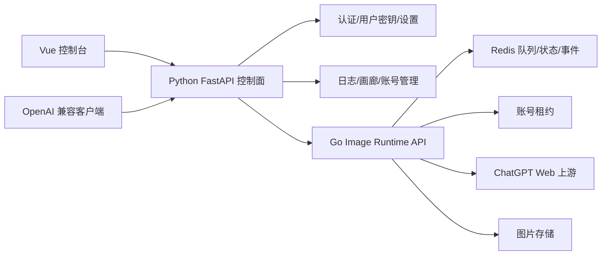

# Go 图片运行时契约草案

这份文档定义 Python 控制面和 Go 图片数据面的内部接口。目标不是马上全量重写，而是先把图片长任务从 Python API 进程里拆出去，让高并发、排队、上传、轮询、重试、取消和恢复都集中在一个更适合长 I/O 的运行时里。

## 架构定位

推荐形态：



Python 保留控制面：

- 登录认证。
- 用户密钥。
- 设置。
- 账号导入、刷新、OAuth、CPA、Sub2API。
- 日志查询。
- 画廊。
- 备份。
- OpenAI 兼容入口壳。

Go 负责图片数据面：

- 准入控制。
- 图片任务队列。
- 账号租约。
- 参考图上传。
- 上游 SSE。
- 图片结果轮询。
- 结果下载。
- 重试、取消、超时。
- 阶段事件和结构化错误。

## 为什么不是全 Go

全 Go 的问题不是性能，而是风险。

现在 Python 里已经有成熟的认证、号池、设置、导入、OAuth、日志、画廊和兼容接口。直接全 Go 等于把稳定控制面也推倒重写，会把真正要解决的图片并发问题拖成一个大项目。

Go 也不能解决这些外部限制：

- 上游 ChatGPT Web 出图耗时。
- 账号真实额度。
- 单账号限制。
- 代理和出口网络。
- 大图上传下载带宽。

因此第一阶段只让 Go 接管图片长任务，不动控制面。

## 为什么不是全 Python

全 Python 可以继续优化到中等规模，但要到 1000 图片任务/分钟，当前形态要改的东西本来就很多：

- `threading.Thread` 需要变成稳定 worker pool。
- `data/image_tasks.json` 需要换成 Redis/Postgres。
- 单进程账号槽位需要变成分布式租约。
- 长请求、轮询、下载需要脱离 API 进程。
- 多实例需要共享任务状态和账号锁。

做到这些以后，核心图片运行时已经是一个独立数据面。既然要独立，Go 的 goroutine、channel、context、超时取消和 I/O 并发更适合承载这个模块。

## 内部鉴权

Python 调 Go 使用内部服务密钥。

请求头：

```http
X-Internal-Token: <shared-secret>
X-Request-Id: <uuid>
```

要求：

- Go 只接受内网或受信反代流量。
- `X-Request-Id` 全链路透传到日志。
- 失败响应必须包含 `error_code`。

## 任务提交接口

### `POST /internal/image-tasks`

Python 把图片任务提交给 Go。

请求：

```json
{
  "client_task_id": "front-uuid-or-hash",
  "owner_id": "admin",
  "source_endpoint": "/api/image-tasks/edits",
  "mode": "edit",
  "model": "gpt-image-2",
  "prompt": "生成图片...",
  "size": "1024x1536",
  "quality": "auto",
  "n": 1,
  "response_format": "url",
  "base_url": "https://example.com",
  "images": [
    {
      "name": "image_1.png",
      "mime_type": "image/png",
      "size_bytes": 123456,
      "source": {
        "type": "object_ref",
        "url": "http://python-control/internal/assets/tmp/abc"
      }
    }
  ],
  "account_policy": {
    "group": "default",
    "allow_emails": [],
    "deny_emails": []
  },
  "timeouts": {
    "queue_ms": 60000,
    "run_ms": 300000,
    "upload_ms": 120000,
    "poll_ms": 300000
  }
}
```

响应：

```json
{
  "task_id": "img_01hz...",
  "client_task_id": "front-uuid-or-hash",
  "status": "queued",
  "stage": "queued",
  "created_at": "2026-06-03T08:00:00Z",
  "updated_at": "2026-06-03T08:00:00Z"
}
```

要求：

- `client_task_id + owner_id` 幂等。
- 重复提交返回已有任务。
- Go 不信任前端，所有调用都来自 Python。
- Python 可以选择先把 multipart 图片保存成临时对象，再给 Go `object_ref`。

## 任务查询接口

### `GET /internal/image-tasks/{task_id}`

响应：

```json
{
  "task_id": "img_01hz...",
  "client_task_id": "front-uuid-or-hash",
  "owner_id": "admin",
  "status": "running",
  "stage": "polling",
  "mode": "edit",
  "model": "gpt-image-2",
  "size": "1024x1536",
  "quality": "auto",
  "n": 1,
  "account_email": "user@example.com",
  "conversation_id": "6a1f...",
  "progress": {
    "queued_wait_ms": 1200,
    "account_acquire_ms": 300,
    "input_fetch_ms": 0,
    "input_bytes": 123456,
    "upload_ms": 2100,
    "upstream_sse_ms": 5500,
    "poll_ms": 43000,
    "result_download_ms": null,
    "store_ms": null,
    "total_ms": 52000
  },
  "result": {
    "images": []
  },
  "error": null,
  "can_resume_poll": false,
  "created_at": "2026-06-03T08:00:00Z",
  "updated_at": "2026-06-03T08:00:52Z"
}
```

### `GET /internal/image-tasks?ids=...`

批量查询，给前端轮询列表使用。Python 对外仍暴露 `/api/image-tasks?ids=...`。

## 事件接口

### `GET /internal/image-tasks/events`

SSE 事件流。

事件类型：

- `snapshot`
- `task.upsert`
- `task.remove`
- `task.log`

`task.upsert` 示例：

```json
{
  "event": "task.upsert",
  "task_id": "img_01hz...",
  "status": "running",
  "stage": "uploading",
  "account_email": "user@example.com",
  "conversation_id": null,
  "progress": {
    "input_bytes": 123456,
    "upload_ms": null
  },
  "updated_at": "2026-06-03T08:00:09Z"
}
```

第一版可以先让 Python 轮询 Go，再给前端轮询。1000 TPM 目标下，最终建议前端接 Python 暴露的 SSE，Python 可以转发 Go 事件，也可以从 Redis 事件流读取。

## 取消与恢复轮询

### `POST /internal/image-tasks/{task_id}/cancel`

要求：

- 如果任务还在队列，直接取消。
- 如果任务运行中，Go 通过 context cancel 停止后续上传、SSE、poll、下载。
- 取消时释放账号租约。

### `POST /internal/image-tasks/{task_id}/resume-poll`

请求：

```json
{
  "extra_timeout_ms": 300000
}
```

适用条件：

- 任务有 `conversation_id`。
- 错误码是 `poll_timeout` 或 `upstream_text_reply`。
- 原任务没有成功拿到结果图。

## 账号租约接口

第一阶段可以由 Go 直接读 Redis/Postgres 的账号快照，也可以由 Python 提供内部账号接口。推荐先由 Python 提供账号信息，Go 只维护 Redis 租约。

账号快照字段：

```json
{
  "account_id": "acc_123",
  "email": "user@example.com",
  "access_token": "...",
  "proxy": "http://...",
  "status": "active",
  "image_enabled": true,
  "priority": 100,
  "group": "default",
  "quota": {
    "available": true,
    "reset_at": null
  }
}
```

Redis 租约：

```text
image:lease:{account_id} = {owner}:{task_id}:{fencing_token}
ttl = 180-300s
```

要求：

- 获取租约必须原子化。
- 释放租约必须校验 owner 和 fencing token。
- 长任务运行中要续约。
- Go 任务结束后把账号结果回写给 Python：成功、限流、异常、内容策略、网络失败。

## 账号结果回写

### `POST /internal/accounts/{account_id}/image-result`

Go 调 Python。

请求：

```json
{
  "task_id": "img_01hz...",
  "account_email": "user@example.com",
  "result": "failed",
  "error_code": "image_upload_failed",
  "conversation_id": "6a1f...",
  "duration_ms": 119540,
  "occurred_at": "2026-06-03T08:02:44Z"
}
```

Python 负责更新账号状态、失败次数和日志。

## 图片存储交接

有两种模式：

### 模式 A：Go 下载并保存图片

Go 完成：

- 下载上游结果图。
- 保存到本地或对象存储。
- 生成可访问 URL。
- 把 URL 回写给 Python。

优点：

- 数据面闭环。
- Python API 进程不吃图片下载流量。

缺点：

- Go 需要接入现有图片存储和画廊索引。

### 模式 B：Go 只返回上游图片 URL

Python 完成：

- 下载结果图。
- 保存到现有图片系统。

优点：

- 改动小。
- 画廊逻辑保留。

缺点：

- Python 仍吃输出带宽。
- 高并发下不能完全解决长 I/O 压力。

推荐路线：

1. POC 阶段用模式 B，减少改动。
2. 稳定后切到模式 A，让 Go 数据面真正闭环。

## 错误响应契约

所有失败必须结构化：

```json
{
  "error_code": "upstream_text_reply",
  "message": "上游返回文本但没有产出图片资产",
  "stage": "polling",
  "conversation_id": "6a1f...",
  "raw": "明白了，你希望我生成..."
}
```

标准错误码：

- `queue_full`
- `queue_timeout`
- `no_available_account`
- `account_limited`
- `input_fetch_failed`
- `input_too_large`
- `image_upload_failed`
- `invalid_referenced_image_id`
- `upstream_text_reply`
- `poll_timeout`
- `result_download_failed`
- `content_policy`
- `network_timeout`
- `storage_failed`
- `cancelled`
- `unknown`

## 日志契约

每个任务至少写三类日志：

1. 任务生命周期日志。
2. 账号租约日志。
3. 上游交互日志。

日志必须包含：

- `request_id`
- `task_id`
- `client_task_id`
- `owner_id`
- `stage`
- `status`
- `account_email`
- `conversation_id`
- `error_code`
- `duration_ms`
- `input_bytes`
- `result_bytes`

这些字段会进入新前端的日志中心和图片任务详情页。

## 迁移顺序

1. 先在 Python 现有链路补阶段耗时和错误分类。
2. 写 Go image runtime POC，只接 mock upstream。
3. 接 Redis 任务队列和租约。
4. 用 Python 把 `/api/image-tasks/*` 转发给 Go。
5. 新 Vue 前端只接 `/api/image-tasks/*`，不直接碰 Go。
6. 小流量把真实图生图任务切到 Go。
7. 稳定后再考虑 `/v1/images/*` 是否也转任务，或者继续同步兼容。

## 不立即迁移的内容

这些先留在 Python：

- 用户登录。
- 用户密钥。
- 管理员设置。
- 账号导入和 OAuth。
- CPA/Sub2API。
- 运行日志查询。
- 图片画廊第一版。
- 备份。
- 注册机集成。

## 成功标准

Go 图片运行时第一阶段算成功，需要满足：

- 2000 个 mock active tasks 不爆内存。
- 多实例不会重复租用同一账号。
- 图生图上传失败能明确显示 `image_upload_failed`。
- 上游文本回复能明确显示 `upstream_text_reply` 和原始文本。
- poll 超时能恢复轮询。
- 前端任务详情能看出卡在哪一段。
- Python API 进程不再被长时间图片任务拖死。
