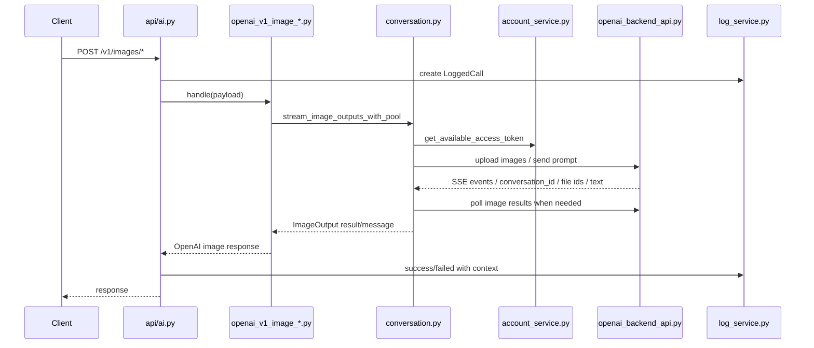
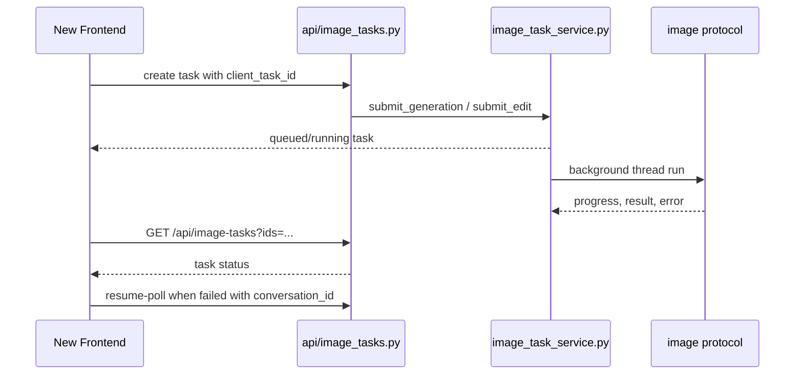

# 图片生成链路

## 两类入口

### OpenAI 兼容入口

- `POST /v1/images/generations`
- `POST /v1/images/edits`

适合外部 API 客户端使用。请求会同步等待结果，失败时按 OpenAI 风格返回错误。

### 管理台任务入口

- `POST /api/image-tasks/generations`
- `POST /api/image-tasks/edits`
- `GET /api/image-tasks?ids=...`
- `POST /api/image-tasks/{task_id}/resume-poll`

适合新前端使用。浏览器不直接等待长请求，页面通过任务状态轮询。

## 图生图输入

`api/image_inputs.py` 支持：

- multipart 文件上传。
- JSON `image`、`images`、`image_url`。
- base64 image。
- data URL。
- http/https image URL。

明确不支持：

- OpenAI `file_id` 作为入参图片引用。

原因：这个项目对 ChatGPT Web 上游需要真实图片内容或可下载 URL，不是官方 OpenAI Files API。

## 同步图片请求流程

## 异步图片任务流程

## 关键状态

任务状态：

- `queued`
- `running`
- `success`
- `error`

前端进度可显示：

- `getting_account`
- `image_stream_resolve_start`
- `receiving_image`
- `image_upload_prepare`
- `image_upload_registered`
- `image_upload_complete`
- `image_upload_failed`

这些进度不一定全部出现在现有 UI；新 UI 可以把它们映射成中文状态。

## 常见失败类型

### 上游返回文本但没出图

特征：

- 有 `message`。
- 可能包含 `{ "prompt": ..., "size": ..., "referenced_image_ids": ... }`。
- 没有真正图片资产。

当前逻辑：

- 检测为 `upstream_text_reply`。
- 尝试延长 poll。
- 失败后换账号重试。
- 重试耗尽后给前端返回可读错误。

### 图片 URL 或上传失败

特征：

- `image_url fetch failed`
- `image_url must point to an image`
- `image_url exceeds 50MB limit`
- 上传阶段出现 `image_upload_failed`

前端应该明确提示是输入图片问题，而不是账号问题。

### poll 超时

特征：

- 有 `conversation_id`。
- 初始流没有拿到 file id。
- 后续任务可能仍在上游后台生成。

处理：

- 新前端显示 `resume-poll` 按钮。
- 后端用 `/api/image-tasks/{task_id}/resume-poll` 继续查。

### 内容策略

特征：

- `ImageContentPolicyError`。
- 上游任务详情可能包含具体 policy 文本。

前端应该展示简化错误，但日志详情应保留原始上下文。

### 账号池问题

特征：

- no available image account。
- 单账号并发槽占满。
- 账号状态被标为 `限流`、`异常`、`禁用`。

前端应该把账号池状态和图片失败放在同一诊断视图中。

## 新前端要求

- 图片生成页面必须走任务接口。
- 每个图片任务详情页显示：
  - task id
  - client task id，当前等同于 task id
  - status
  - model
  - prompt，当前任务接口不公开保存，第一版可从前端本地提交记录显示
  - progress
  - elapsed/duration
  - account_email，当前任务接口不稳定提供，建议后端补强
  - conversation_id，当前仅部分错误场景提供
  - error
  - result images
- 失败任务如果有 `conversation_id`，应提供恢复轮询操作。

## 已知展示缺口

当前任务服务更像“轻量状态机”，不是完整诊断模型。它能支撑新前端避免长请求卡死，但要做专业排错页，还需要补：

- 任务持久化 `conversation_id`、`progress`、`account_email`。
- 错误分类字段，例如 `upstream_text_reply`、`image_upload_failed`、`timeout`。
- `can_resume_poll`，由后端根据错误类型和会话 ID 判断。
- 任务和调用日志之间的关联字段。

这些补强不需要大拆 `conversation.py`，优先在 `image_task_service.py` 和 `log_service.py` 的展示模型里做。
